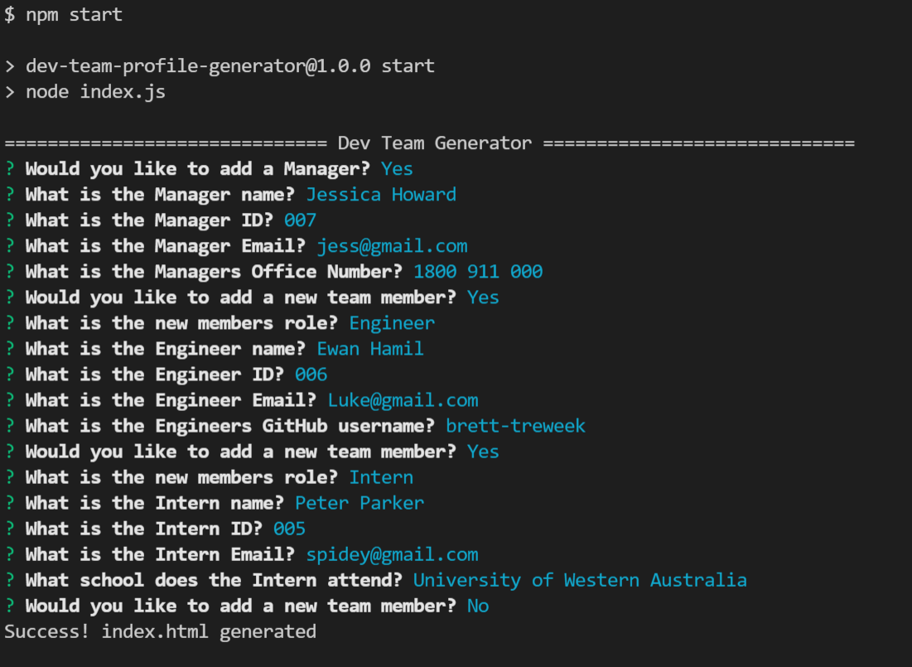
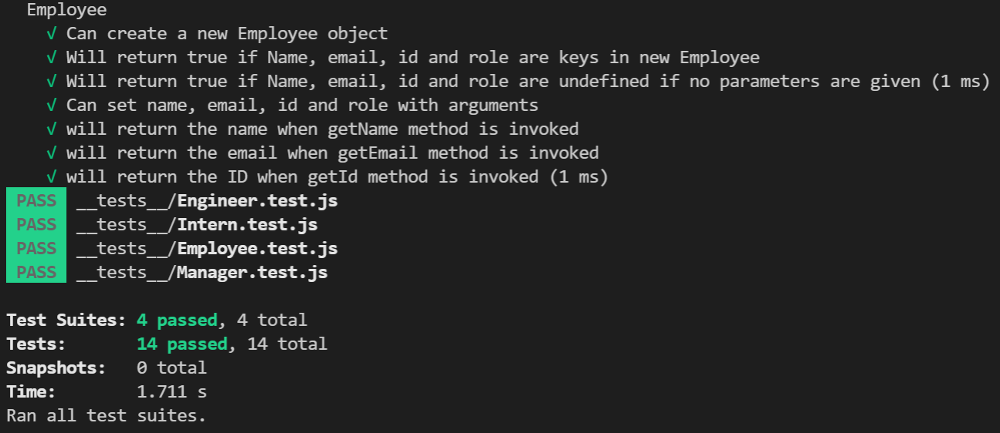

# Dev Team Profile Generator


## Description
  
  
  
This CLI app is designed to generate a team profile web page from team member details that are gathered from command line prompts. 
It uses node.js and the inquirer module to produce a series of question prompts, and
then populates an html page with the answers. It results in a new html file being
created with formatting and styling applied.  
  
Information that is gathered include
- Employees Name, Id, Email and Role.
- Managers office number.
- Engineers GitHub username.
- Name of Interns School.

---
## Table of Contents

- [Installation](#installation)
- [Usage](#usage)
- [License](#license)
- [Contributing](#contributing)
- [Tests](#tests)
- [Questions](#questions)

---
## Installation

Please follow these steps to install the project and any dependancies.

```bash
install node.js
install npm
install inquirer
install jest

```

---
## Usage

[Here is a link to a walkthrough](https://drive.google.com/file/d/1LG07zwsB0G4Ae_E2sGQ7sr7RJHtJlWYS/view)

- Run the app with the following command.   

    ```bash
    npm start
    ```
- Follow the question prompts and hit enter to save your answer.
- You can create as many Employees as you want.
- The included background template images are placeholders only and can be replaced as needed.
- Html file will be generated in the dist folder.
- Styling is applied via the CSS file in dist folder.
  
---


---
## License

This project is licensed under 

---
## Contributing

Contributions to this project are not currently accepted.

---
## Tests
- Jest is used to build tests. 
- There are three suites of tests for this project that test the Employee constructor object and Manager, Intern and Engineer sub-classes.

Please use these commands to perform tests.

```bash

npm test

```
  

---
## Questions

For any questions and support please contact Brett Treweek at bretttrew@gmail.com or message me through [GitHub](https://github.com/brett-treweek).